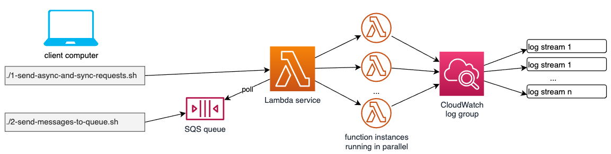
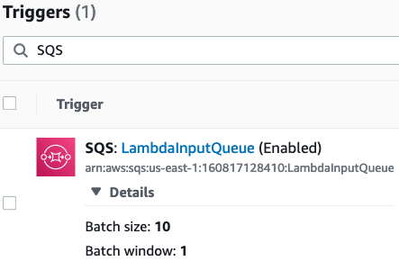

# Lambda Concurrency tests based on simple AWS CLI invocations

The SAM template deploys a Lambda function, an SQS queue which acts as a trigger and the IAM permissions required to run the application. SQS invokes the Lambda function when new messages are available.

The deployment foundation is taken from here: [serverlessland.com/patterns/sql-lambda](https://serverlessland.com/patterns/sqs-lambda)

Important: this application uses various AWS services and there are costs associated with these services after the Free Tier usage - please see the [AWS Pricing page](https://aws.amazon.com/pricing/) for details. You are responsible for any AWS costs incurred. No warranty is implied in this example.

## Requirements

* [Create an AWS account](https://portal.aws.amazon.com/gp/aws/developer/registration/index.html) if you do not already have one and log in. The IAM user that you use must have sufficient permissions to make necessary AWS service calls and manage AWS resources.
* [AWS CLI](https://docs.aws.amazon.com/cli/latest/userguide/install-cliv2.html) installed and configured
* [Git Installed](https://git-scm.com/book/en/v2/Getting-Started-Installing-Git)
* [AWS Serverless Application Model](https://docs.aws.amazon.com/serverless-application-model/latest/developerguide/serverless-sam-cli-install.html) (AWS SAM) installed

## Deployment Instructions

1. Create a new directory, navigate to that directory in a terminal and clone the GitHub repository:
    ``` 
    git clone (this repo URL)
    ```
1. Change directory to the pattern directory:
    ```
    cd Lambda-Concurrency
    ```
1. From the command line, use AWS SAM to deploy the AWS resources for the pattern as specified in the template.yml file:
    ```
    sam deploy --guided
    ```
1. Perform the following entries: 
    ```
    sam deploy --guided

       Configuring SAM deploy
       ======================

       Looking for config file [samconfig.toml] :  Not found

       Setting default arguments for 'sam deploy'
       =========================================
       Stack Name [sam-app]: sam-Lambda-Concurrency
       AWS Region [us-east-1]:
       #Shows you resources changes to be deployed and require a 'Y' to initiate deploy
       Confirm changes before deploy [y/N]: y
       #SAM needs permission to be able to create roles to connect to the resources in your template
       Allow SAM CLI IAM role creation [Y/n]: Y
       Save arguments to configuration file [Y/n]: Y
       SAM configuration file [samconfig.toml]:
       SAM configuration environment [default]:

    ```

    If you have run `sam deploy -guided` mode once and saved arguments to a configuration file (samconfig.toml), you can use `sam deploy` in future to use these defaults.
    
## Architecture overview
    


The architecture overview shows how you can test the three different Lambda invocation types:

1. a) Asynchronous invocation: Using the script "load-tests/1-send-async-and-sync-requests.sh", we first of all send one asynchrounous event, then we check the respective entry in the CloudWatch log group. Veryfy that in the script, the variable TYPE is set to "Event". This simulates e.g. an S3 bucket notification being sent to a bucket.
Please note that on the command line of your computer, you see something like 
   
```
-----------------------
|       Invoke        |
+-------------+-------+
|  StatusCode |  202  |
+-------------+-------+
```

once the request has been sent. This is because in this async request situation, Lambda only sends an HTTP 202 code to comfirm that the message has been received. The Lambda function itself lastst for about 3 seconds (see the sleep(3) command inside of the Lambda Code), but after having finished, Lambda sends no additional response as we are working asynchronously here.


1. b) Synchronous invocation: in the same script as above, we now set TYPE="RequestResponse", which means that now, requests are sent synchronously to the Lambda function, just like e.g. API Gateway would do it. After the AWS CLI has taken place and sent to the background, it takes around 3 seconds until Lambda returns  

```
-----------------------------------
|             Invoke              |
+------------------+--------------+
|  ExecutedVersion | StatusCode   |
+------------------+--------------+
|  $LATEST         |  200         |
+------------------+--------------+
```

So this response is based upon the finalization of the Lambda function process.


2. Polling: the last variant is the one where a Lambda function has an SQS queue attached to it as a trigger source. Remember that SQS queues, following the typical queue pattern, do not actively send data to consumers. Instead, consumers need to poll the queue for new messages, and that is exactly what Lambda is doing. As a first test, we invoke "load-tests/2-send-message-to-queue.sh" which sends one single message to the queue, containing a random number to identify different messages, apart from their messageId. As a result on the command line, we see something like this:

```
------------------------------------------------------------------------------
|                                 SendMessage                                |
+-----------------------------------+----------------------------------------+
|         MD5OfMessageBody          |               MessageId                |
+-----------------------------------+----------------------------------------+
|  75db4515985089778baca77b6de0f32c |  b228f308-60a6-4f92-b921-8454c46552c4  |
+-----------------------------------+----------------------------------------+
```

This clarifies that the queue has accepted the message. As can be seen in CloudWatch logs, Lambda is immediately fetching the message from the queue and makes an entry in the log group.

### Now let's send more than 1 request at once!

So you might wonder where we see concurrency here? Well, so far we have done some preliminary work to understand the test setup.

Let's go into the case 1 a) first, so the async one. Set TYPE back to "Event" to switch on async processing. Then change COUNT from 1 to e.g. 10. This fires 10 async requests against Lambda. After having done that, you get 10 HTTP 202 confirmations on your command line, one for each invocation. On the cloudWatch side, you see around 10 new log streams - because Lambda was not able to handle the requests sequentially, they have been sent too fast. The fact that we have around 10 new log streams shows us that behind the scenes, 10 Lambda function instances have been running in parallel.

The same is true for case 1 b), if you set TYPE again to "RequestResponse".

If we look at case 2) and set accordingly the variable COUNT=20 in script "load-tests/2-send-message-to-queue.sh", we see that 10 queue entries are confirmed on the command line, each with a different messageId. But if we look into CloudWatch logs, Lambda has written only to something like 2 log streams. Why is that? That is because if you look at the Lambda settings here:



You see that BatchSize is set to 10. That means that within one step, Lambda fetches 10 messages from the queue at once, and this batch is processed in one single Lambda instance, which means that we equally see Lambda writing to only around 2 log streams. "Around two log streams" because it might occur that due to performance reasons, the number of messages per log stream might be sometimes smaller than 10.

### And now let us set a reserved concurrency value!

If we go into the Lambda Function Configuration settings in the AWS Management Console, and into "Concurrency", under Concurrency - Edit we can set e.g. the Reserved Concurrency to 5. This means that from our default 1000 parallel Lambda invocations per Region, we now have reserved 5 for this Lambda function.

What does this mean for our 3 different invocation types?

For type 1 a) async invocation: at first, we would not see any difference, all 10 requests are processed. Why? Because Lambda makes use of an internal queue which is storing invokations that go beyond 5 requests in parallel.

For type 1 b) synchronous invocations, we get 5 positive responses (HTTP 200), and 5 negative ones (HTTP 429 = TooManyRequests), because here Lambda throttles the requests which exceed the Reserved Concurrency value.

For type 2 which is SQS based invocations, we do not see any consequenses either, because again Lambda stores messages which go beyond the Reserved Concurrency value in an internal queue.

### Test strategy

Technically, this setup is done as simple as possible. That is, instead of using a sophisticated test tool, we simply use bash scripts to invoke a sequence of AWS CLI commands either sending test requests to Lambda directly or creating messages in an SQS queue. To enable quasi-parallel request creation, we send the AWS CLI commands to the background after they have been created, which enables us to create well above 100 requests per second which is fully sufficient here.

## Cleanup
 
1. Delete the stack
    ```bash
    ./delete-stack.sh
    ```
1. Confirm the stack has been deleted
    ```bash
    aws cloudformation list-stacks --query "StackSummaries[?contains(StackName,'STACK_NAME')].StackStatus"
    ```
----

SPDX-License-Identifier: MIT-0
